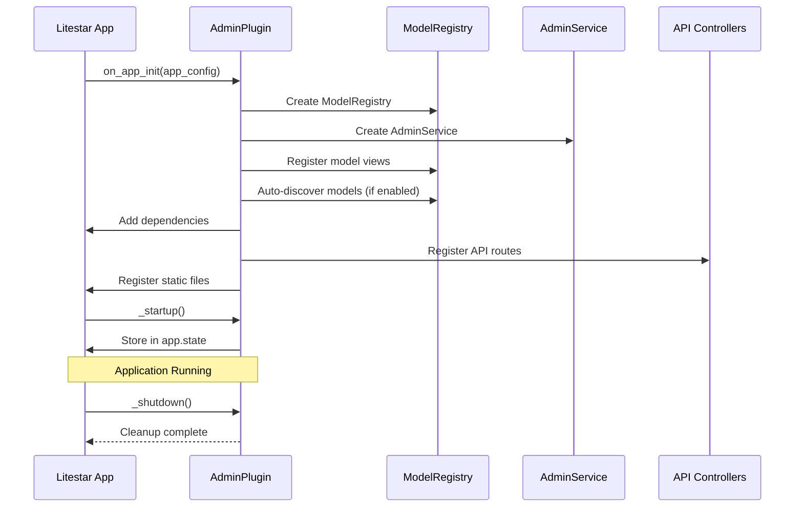
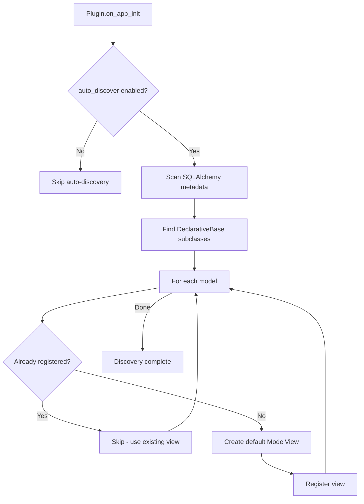
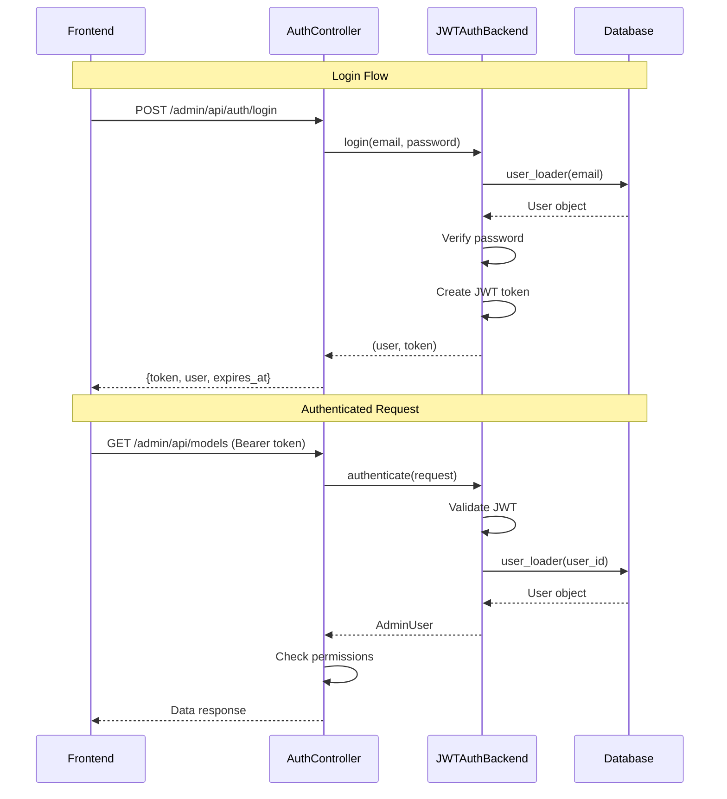

# litestar-admin: Comprehensive Architectural Design

## Executive Summary

**litestar-admin** is a modern, production-ready admin panel framework for Litestar applications. It provides a Cloudflare dashboard-inspired interface with full CRUD operations, RBAC authorization, audit logging, and seamless integration with SQLAlchemy/Advanced-Alchemy models.

### Key Design Decisions

| Decision | Choice | Rationale |
|----------|--------|-----------|
| Frontend Strategy | Next.js Static Export (Primary) | Modern DX, rich interactivity, no runtime Node.js |
| UI Framework | Tailwind CSS 4.x | Cloudflare aesthetic, dark theme support |
| Linting/Formatting | oxlint + oxfmt | OXC.rs ecosystem, faster than ESLint/Prettier |
| Backend Framework | Litestar 2.x + Advanced-Alchemy | Native integration, type safety |
| Authentication | JWT + OAuth2 (pluggable) | Flexible, integrates with litestar-oauth |
| Database | SQLAlchemy 2.x via Advanced-Alchemy | ORM abstraction, async support |

---

## 1. System Architecture

### 1.1 High-Level Architecture

```
+------------------------------------------------------------------+
|                     litestar-admin System                         |
+------------------------------------------------------------------+
|                                                                    |
|  +------------------------+    +-----------------------------+     |
|  |   Frontend (Next.js)   |    |   REST API Layer            |     |
|  |   Static Export        |<-->|   /admin/api/*              |     |
|  |   /admin/*             |    |                             |     |
|  +------------------------+    +-----------------------------+     |
|           |                               |                        |
|           v                               v                        |
|  +------------------------+    +-----------------------------+     |
|  |   Static File Serving  |    |   AdminPlugin               |     |
|  |   (Litestar)           |    |   - Controllers             |     |
|  +------------------------+    |   - Guards                   |     |
|                                |   - Middleware               |     |
|                                +-----------------------------+     |
|                                            |                       |
|  +----------------------------------------------------------+     |
|  |                    Core Services                          |     |
|  +----------------------------------------------------------+     |
|  | ModelRegistry | ModelView | AdminService | AuditLogger   |     |
|  +----------------------------------------------------------+     |
|                                |                                   |
|  +----------------------------------------------------------+     |
|  |                    Data Layer                             |     |
|  +----------------------------------------------------------+     |
|  | SQLAlchemy Models | Advanced-Alchemy | sqladmin-bridge   |     |
|  +----------------------------------------------------------+     |
|                                                                    |
+------------------------------------------------------------------+
```

### 1.2 Component Diagram

```
litestar-admin/
+-- Plugin Layer
|   +-- AdminPlugin (InitPluginProtocol)
|   +-- AdminConfig (Configuration dataclass)
|   +-- AdminMiddleware (Auth checking)
|
+-- Registry Layer
|   +-- ModelRegistry (Auto-discovery, manual registration)
|   +-- ModelViewRegistry (View class mapping)
|   +-- ActionRegistry (Bulk actions, custom actions)
|
+-- View Layer
|   +-- BaseModelView (Abstract base)
|   +-- ListView (Pagination, filtering, sorting)
|   +-- DetailView (Single record display)
|   +-- CreateView (Form generation, validation)
|   +-- EditView (Update operations)
|
+-- Controller Layer
|   +-- ModelsController (CRUD endpoints)
|   +-- DashboardController (Analytics, widgets)
|   +-- AuthController (Login, logout, refresh)
|   +-- ExportController (CSV, JSON export)
|   +-- BulkActionsController (Batch operations)
|
+-- Security Layer
|   +-- Guards (RBAC permission checks)
|   +-- AuditLogger (Action logging)
|   +-- RateLimiter (Request throttling)
|
+-- Frontend Layer
    +-- Next.js App (Static export)
    +-- Components (Cloudflare-inspired UI)
    +-- API Client (TypeScript SDK)
```

---

## 2. Plugin Design

### 2.1 AdminPlugin Class

```python
# src/litestar_admin/plugin.py
"""Litestar Admin Plugin - Main entry point."""

from __future__ import annotations

from dataclasses import dataclass, field
from typing import TYPE_CHECKING, Any, Sequence

from litestar.di import Provide
from litestar.plugins import InitPluginProtocol

if TYPE_CHECKING:
    from litestar import Router
    from litestar.config.app import AppConfig
    from litestar.types import Guard

    from litestar_admin.auth import AuthBackend
    from litestar_admin.registry import ModelRegistry
    from litestar_admin.views import BaseModelView

__all__ = ["AdminPlugin", "AdminConfig"]


@dataclass
class AdminConfig:
    """Configuration for the Admin Plugin.

    Attributes:
        title: Admin panel title displayed in the header.
        path_prefix: URL path prefix for admin routes. Defaults to "/admin".
        api_path_prefix: URL path prefix for API routes. Defaults to "/admin/api".
        logo_url: Optional URL for a custom logo.
        favicon_url: Optional URL for a custom favicon.
        theme: Color theme ("dark", "light", "auto"). Defaults to "dark".
        primary_color: Primary accent color (hex). Defaults to "#f38020" (Cloudflare orange).
        enable_api: Whether to enable the REST API endpoints. Defaults to True.
        enable_docs: Whether to include admin API in OpenAPI docs. Defaults to False.
        auth_backend: Authentication backend instance. Required for production.
        guards: Global guards applied to all admin routes.
        models: List of ModelView classes to register.
        auto_discover: Whether to auto-discover SQLAlchemy models. Defaults to True.
        dependency_key: Key for admin service dependency injection.
        enable_audit_log: Whether to log admin actions. Defaults to True.
        audit_log_retention_days: Days to retain audit logs. Defaults to 90.
        date_format: Date format for display. Defaults to "YYYY-MM-DD".
        datetime_format: Datetime format for display. Defaults to "YYYY-MM-DD HH:mm:ss".
        items_per_page: Default items per page in list views. Defaults to 25.
        max_items_per_page: Maximum items per page allowed. Defaults to 100.
        enable_export: Whether to enable data export. Defaults to True.
        export_formats: Allowed export formats. Defaults to ["csv", "json"].
        static_files_path: Path to static files directory. Auto-detected if None.
        session_timeout: Session timeout in seconds. Defaults to 3600.
    """

    title: str = "Admin Panel"
    path_prefix: str = "/admin"
    api_path_prefix: str = "/admin/api"
    logo_url: str | None = None
    favicon_url: str | None = None
    theme: str = "dark"
    primary_color: str = "#f38020"

    # API configuration
    enable_api: bool = True
    enable_docs: bool = False

    # Authentication
    auth_backend: AuthBackend | None = None
    guards: list[Guard] = field(default_factory=list)

    # Model registration
    models: list[type[BaseModelView]] = field(default_factory=list)
    auto_discover: bool = True

    # Dependency injection
    dependency_key: str = "admin_service"

    # Audit logging
    enable_audit_log: bool = True
    audit_log_retention_days: int = 90

    # Display settings
    date_format: str = "YYYY-MM-DD"
    datetime_format: str = "YYYY-MM-DD HH:mm:ss"
    items_per_page: int = 25
    max_items_per_page: int = 100

    # Export settings
    enable_export: bool = True
    export_formats: list[str] = field(default_factory=lambda: ["csv", "json"])

    # Static files
    static_files_path: str | None = None

    # Session
    session_timeout: int = 3600


class AdminPlugin(InitPluginProtocol):
    """Litestar plugin for admin panel integration.

    This plugin integrates litestar-admin with a Litestar application,
    providing dependency injection for the AdminService and ModelRegistry.

    Example:
        Basic usage::

            from litestar import Litestar
            from litestar_admin import AdminPlugin, AdminConfig

            app = Litestar(
                plugins=[
                    AdminPlugin(
                        config=AdminConfig(
                            title="My Admin",
                            auth_backend=JWTAuthBackend(...),
                        )
                    )
                ]
            )

        With model views::

            from litestar_admin import AdminPlugin, AdminConfig, ModelView

            class UserAdmin(ModelView, model=User):
                column_list = ["id", "email", "created_at"]
                column_searchable_list = ["email"]
                can_create = True
                can_edit = True
                can_delete = False

            app = Litestar(
                plugins=[
                    AdminPlugin(
                        config=AdminConfig(
                            models=[UserAdmin],
                        )
                    )
                ]
            )
    """

    __slots__ = ("_config", "_registry", "_service")

    def __init__(self, config: AdminConfig | None = None) -> None:
        """Initialize the admin plugin.

        Args:
            config: Optional configuration for the plugin.
        """
        self._config = config or AdminConfig()
        self._registry: ModelRegistry | None = None
        self._service: AdminService | None = None

    @property
    def config(self) -> AdminConfig:
        """Get the plugin configuration."""
        return self._config

    @property
    def registry(self) -> ModelRegistry:
        """Get the model registry.

        Raises:
            RuntimeError: If accessed before plugin initialization.
        """
        if self._registry is None:
            msg = "AdminPlugin not initialized. Access registry after app startup."
            raise RuntimeError(msg)
        return self._registry

    @property
    def service(self) -> AdminService:
        """Get the admin service.

        Raises:
            RuntimeError: If accessed before plugin initialization.
        """
        if self._service is None:
            msg = "AdminPlugin not initialized. Access service after app startup."
            raise RuntimeError(msg)
        return self._service

    def on_app_init(self, app_config: AppConfig) -> AppConfig:
        """Initialize the plugin when the Litestar app starts.

        This method:
        1. Creates the ModelRegistry and AdminService
        2. Registers model views (manual + auto-discovered)
        3. Adds dependency providers
        4. Registers REST API controllers if enabled
        5. Configures static file serving for frontend

        Args:
            app_config: The Litestar application configuration.

        Returns:
            The modified application configuration.
        """
        from litestar_admin.registry import ModelRegistry
        from litestar_admin.service import AdminService

        # Initialize registry and service
        self._registry = ModelRegistry()
        self._service = AdminService(
            registry=self._registry,
            config=self._config,
        )

        # Register manually specified models
        for model_view in self._config.models:
            self._registry.register(model_view)

        # Auto-discover models if enabled
        if self._config.auto_discover:
            self._registry.auto_discover()

        # Create dependency providers
        def provide_admin_service() -> AdminService:
            return self._service  # type: ignore[return-value]

        def provide_model_registry() -> ModelRegistry:
            return self._registry  # type: ignore[return-value]

        # Add dependencies
        app_config.dependencies[self._config.dependency_key] = Provide(
            provide_admin_service,
            sync_to_thread=False,
        )
        app_config.dependencies["model_registry"] = Provide(
            provide_model_registry,
            sync_to_thread=False,
        )

        # Add lifecycle hooks
        app_config.on_startup.append(self._startup)
        app_config.on_shutdown.append(self._shutdown)

        # Register API controllers if enabled
        if self._config.enable_api:
            self._register_api_controllers(app_config)

        # Register static file serving
        self._register_static_files(app_config)

        return app_config

    def _register_api_controllers(self, app_config: AppConfig) -> None:
        """Register REST API controllers."""
        from litestar import Router

        from litestar_admin.controllers import (
            AuthController,
            BulkActionsController,
            DashboardController,
            ExportController,
            ModelsController,
        )

        controllers = [
            ModelsController,
            DashboardController,
            ExportController,
            BulkActionsController,
        ]

        # Add auth controller if auth backend is configured
        if self._config.auth_backend is not None:
            controllers.append(AuthController)

        # Create main API router
        admin_api_router = Router(
            path=self._config.api_path_prefix,
            route_handlers=controllers,
            guards=self._config.guards,
            tags=["Admin API"] if self._config.enable_docs else [],
            include_in_schema=self._config.enable_docs,
        )

        app_config.route_handlers.append(admin_api_router)

    def _register_static_files(self, app_config: AppConfig) -> None:
        """Register static file serving for the frontend."""
        from pathlib import Path

        from litestar.static_files import create_static_files_router

        # Determine static files path
        if self._config.static_files_path:
            static_path = Path(self._config.static_files_path)
        else:
            # Default: look for bundled frontend in package
            static_path = Path(__file__).parent / "static"

        if static_path.exists():
            static_router = create_static_files_router(
                path=self._config.path_prefix,
                directories=[static_path],
                html_mode=True,  # Serve index.html for SPA routing
            )
            app_config.route_handlers.append(static_router)

    async def _startup(self, app: Litestar) -> None:
        """Initialize resources on startup."""
        import logging

        logger = logging.getLogger(__name__)
        logger.info(
            "Admin panel initialized at %s with %d models",
            self._config.path_prefix,
            len(self._registry.list_models()) if self._registry else 0,
        )

        # Store in app state
        app.state.admin_service = self._service
        app.state.admin_registry = self._registry

    async def _shutdown(self, app: Litestar) -> None:
        """Clean up resources on shutdown."""
        import logging

        logger = logging.getLogger(__name__)
        logger.info("Admin panel shutting down")
```

### 2.2 Plugin Lifecycle



---

## 3. Model Registration

### 3.1 ModelRegistry

```python
# src/litestar_admin/registry.py
"""Model registry for managing admin model views."""

from __future__ import annotations

import importlib
import pkgutil
from typing import TYPE_CHECKING, Any

if TYPE_CHECKING:
    from sqlalchemy.orm import DeclarativeBase

    from litestar_admin.views import BaseModelView

__all__ = ["ModelRegistry"]


class ModelRegistry:
    """Registry for storing and managing model views.

    The registry maintains a mapping of SQLAlchemy models to their
    corresponding ModelView classes, enabling model lookup and
    auto-discovery.

    Attributes:
        _views: Dict mapping model class to ModelView class.
        _views_by_name: Dict mapping model name to ModelView class.
    """

    def __init__(self) -> None:
        """Initialize an empty model registry."""
        self._views: dict[type[DeclarativeBase], type[BaseModelView]] = {}
        self._views_by_name: dict[str, type[BaseModelView]] = {}
        self._discovered: bool = False

    def register(self, view_class: type[BaseModelView]) -> None:
        """Register a ModelView class.

        Args:
            view_class: The ModelView class to register.

        Raises:
            ValueError: If view_class has no model attribute.

        Example:
            >>> registry = ModelRegistry()
            >>> registry.register(UserAdmin)
        """
        model = getattr(view_class, "model", None)
        if model is None:
            msg = f"{view_class.__name__} has no 'model' attribute"
            raise ValueError(msg)

        self._views[model] = view_class
        self._views_by_name[model.__name__] = view_class

    def get_view(self, model: type[DeclarativeBase]) -> type[BaseModelView]:
        """Get the ModelView for a model class.

        Args:
            model: The SQLAlchemy model class.

        Returns:
            The registered ModelView class.

        Raises:
            KeyError: If no view is registered for the model.
        """
        if model not in self._views:
            msg = f"No view registered for model '{model.__name__}'"
            raise KeyError(msg)
        return self._views[model]

    def get_view_by_name(self, name: str) -> type[BaseModelView]:
        """Get the ModelView by model name.

        Args:
            name: The model class name (e.g., "User").

        Returns:
            The registered ModelView class.

        Raises:
            KeyError: If no view is registered for the model name.
        """
        if name not in self._views_by_name:
            msg = f"No view registered for model '{name}'"
            raise KeyError(msg)
        return self._views_by_name[name]

    def list_models(self) -> list[dict[str, Any]]:
        """List all registered models with metadata.

        Returns:
            List of dicts with model name, view class, and permissions.
        """
        result = []
        for model, view in self._views.items():
            result.append({
                "name": model.__name__,
                "table_name": getattr(model, "__tablename__", model.__name__.lower()),
                "view_class": view.__name__,
                "can_create": getattr(view, "can_create", True),
                "can_edit": getattr(view, "can_edit", True),
                "can_delete": getattr(view, "can_delete", True),
                "can_view": getattr(view, "can_view", True),
                "icon": getattr(view, "icon", None),
                "category": getattr(view, "category", None),
            })
        return sorted(result, key=lambda x: x["name"])

    def auto_discover(self, package: str | None = None) -> None:
        """Auto-discover SQLAlchemy models and create default views.

        Scans for SQLAlchemy models and creates default ModelView
        classes for any that don't have explicit registrations.

        Args:
            package: Optional package path to scan. If None, scans
                all imported modules.
        """
        if self._discovered:
            return

        from litestar_admin.views import create_default_view

        # Get all SQLAlchemy models from metadata
        try:
            from advanced_alchemy.base import CommonTableAttributes
            from sqlalchemy.orm import DeclarativeBase

            # Find all subclasses of DeclarativeBase
            discovered_models: list[type[DeclarativeBase]] = []

            for subclass in DeclarativeBase.__subclasses__():
                discovered_models.extend(self._get_all_models(subclass))

            # Register default views for undiscovered models
            for model in discovered_models:
                if model not in self._views:
                    view_class = create_default_view(model)
                    self.register(view_class)

        except ImportError:
            pass  # SQLAlchemy not installed

        self._discovered = True

    def _get_all_models(
        self, base: type[DeclarativeBase]
    ) -> list[type[DeclarativeBase]]:
        """Recursively get all model subclasses."""
        models = []
        for subclass in base.__subclasses__():
            # Check if this is a concrete model (has __tablename__)
            if hasattr(subclass, "__tablename__"):
                models.append(subclass)
            models.extend(self._get_all_models(subclass))
        return models

    def has_model(self, model: type[DeclarativeBase]) -> bool:
        """Check if a model is registered."""
        return model in self._views

    def has_model_by_name(self, name: str) -> bool:
        """Check if a model is registered by name."""
        return name in self._views_by_name

    def unregister(self, model: type[DeclarativeBase]) -> None:
        """Remove a model from the registry."""
        if model in self._views:
            view = self._views.pop(model)
            self._views_by_name.pop(model.__name__, None)
```

### 3.2 Auto-Discovery Flow



---

## 4. View System

### 4.1 BaseModelView

```python
# src/litestar_admin/views/base.py
"""Base model view class for admin panel."""

from __future__ import annotations

from typing import TYPE_CHECKING, Any, ClassVar, Generic, TypeVar

if TYPE_CHECKING:
    from collections.abc import Sequence

    from litestar.connection import ASGIConnection
    from sqlalchemy.orm import DeclarativeBase

__all__ = ["BaseModelView", "ModelView", "create_default_view"]

T = TypeVar("T", bound="DeclarativeBase")


class BaseModelView(Generic[T]):
    """Base class for admin model views.

    This class defines the interface and default behavior for model
    administration. Subclass this to customize how a model appears
    and behaves in the admin panel.

    Class Attributes:
        model: The SQLAlchemy model class (required).
        name: Display name for the model. Defaults to model class name.
        name_plural: Plural display name. Defaults to name + "s".
        icon: Icon name for the sidebar (e.g., "users", "settings").
        category: Category for grouping in sidebar navigation.
        column_list: Columns to display in list view.
        column_exclude_list: Columns to exclude from list view.
        column_searchable_list: Columns that can be searched.
        column_sortable_list: Columns that can be sorted.
        column_default_sort: Default sort column and direction.
        column_filters: Columns that can be filtered.
        form_columns: Columns to include in create/edit forms.
        form_excluded_columns: Columns to exclude from forms.
        form_widget_args: Widget customization for form fields.
        can_create: Whether creation is allowed. Default True.
        can_edit: Whether editing is allowed. Default True.
        can_delete: Whether deletion is allowed. Default True.
        can_view: Whether viewing is allowed. Default True.
        can_export: Whether export is allowed. Default True.
        page_size: Default items per page.
        page_size_options: Available page size options.
    """

    # Required
    model: ClassVar[type[T]]

    # Display
    name: ClassVar[str | None] = None
    name_plural: ClassVar[str | None] = None
    icon: ClassVar[str | None] = None
    category: ClassVar[str | None] = None

    # List view configuration
    column_list: ClassVar[Sequence[str] | None] = None
    column_exclude_list: ClassVar[Sequence[str]] = ()
    column_searchable_list: ClassVar[Sequence[str]] = ()
    column_sortable_list: ClassVar[Sequence[str] | None] = None
    column_default_sort: ClassVar[tuple[str, bool] | None] = None  # (column, desc)
    column_filters: ClassVar[Sequence[str]] = ()

    # Form configuration
    form_columns: ClassVar[Sequence[str] | None] = None
    form_excluded_columns: ClassVar[Sequence[str]] = ()
    form_widget_args: ClassVar[dict[str, dict[str, Any]]] = {}
    form_create_rules: ClassVar[Sequence[str] | None] = None
    form_edit_rules: ClassVar[Sequence[str] | None] = None

    # Permissions
    can_create: ClassVar[bool] = True
    can_edit: ClassVar[bool] = True
    can_delete: ClassVar[bool] = True
    can_view: ClassVar[bool] = True
    can_export: ClassVar[bool] = True

    # Pagination
    page_size: ClassVar[int] = 25
    page_size_options: ClassVar[Sequence[int]] = (10, 25, 50, 100)

    # Formatters and validators
    column_formatters: ClassVar[dict[str, Any]] = {}
    column_type_formatters: ClassVar[dict[type, Any]] = {}
    form_overrides: ClassVar[dict[str, type]] = {}
    form_validators: ClassVar[dict[str, Sequence[Any]]] = {}

    @classmethod
    def get_model_name(cls) -> str:
        """Get the display name for the model."""
        if cls.name:
            return cls.name
        return cls.model.__name__

    @classmethod
    def get_model_name_plural(cls) -> str:
        """Get the plural display name for the model."""
        if cls.name_plural:
            return cls.name_plural
        name = cls.get_model_name()
        # Simple pluralization
        if name.endswith("y"):
            return name[:-1] + "ies"
        if name.endswith(("s", "x", "z", "ch", "sh")):
            return name + "es"
        return name + "s"

    @classmethod
    def get_list_columns(cls) -> list[str]:
        """Get columns for the list view."""
        if cls.column_list is not None:
            return [c for c in cls.column_list if c not in cls.column_exclude_list]

        # Default: all columns except excluded
        from sqlalchemy import inspect

        mapper = inspect(cls.model)
        columns = [c.key for c in mapper.columns]
        return [c for c in columns if c not in cls.column_exclude_list]

    @classmethod
    def get_form_columns(cls, *, is_create: bool = True) -> list[str]:
        """Get columns for create/edit forms."""
        rules = cls.form_create_rules if is_create else cls.form_edit_rules
        if rules is not None:
            return list(rules)

        if cls.form_columns is not None:
            return [c for c in cls.form_columns if c not in cls.form_excluded_columns]

        # Default: all columns except excluded and auto-generated
        from sqlalchemy import inspect

        mapper = inspect(cls.model)
        auto_columns = {"id", "created_at", "updated_at", "deleted_at"}
        columns = [c.key for c in mapper.columns]
        return [
            c for c in columns
            if c not in cls.form_excluded_columns and c not in auto_columns
        ]

    @classmethod
    def get_column_info(cls) -> list[dict[str, Any]]:
        """Get column metadata for the frontend."""
        from sqlalchemy import inspect

        mapper = inspect(cls.model)
        columns_info = []

        for col in cls.get_list_columns():
            if col in mapper.columns:
                sa_col = mapper.columns[col]
                columns_info.append({
                    "key": col,
                    "label": col.replace("_", " ").title(),
                    "type": str(sa_col.type),
                    "sortable": col in (cls.column_sortable_list or cls.get_list_columns()),
                    "searchable": col in cls.column_searchable_list,
                    "filterable": col in cls.column_filters,
                })
            else:
                # Relationship or computed column
                columns_info.append({
                    "key": col,
                    "label": col.replace("_", " ").title(),
                    "type": "relationship",
                    "sortable": False,
                    "searchable": False,
                    "filterable": False,
                })

        return columns_info

    # Permission hooks
    @classmethod
    async def is_accessible(
        cls,
        connection: ASGIConnection[Any, Any, Any, Any],
    ) -> bool:
        """Check if the current user can access this model.

        Override this method to implement custom access control.
        """
        return True

    @classmethod
    async def can_create_record(
        cls,
        connection: ASGIConnection[Any, Any, Any, Any],
    ) -> bool:
        """Check if the current user can create records."""
        return cls.can_create and await cls.is_accessible(connection)

    @classmethod
    async def can_edit_record(
        cls,
        connection: ASGIConnection[Any, Any, Any, Any],
        record: T,
    ) -> bool:
        """Check if the current user can edit a specific record."""
        return cls.can_edit and await cls.is_accessible(connection)

    @classmethod
    async def can_delete_record(
        cls,
        connection: ASGIConnection[Any, Any, Any, Any],
        record: T,
    ) -> bool:
        """Check if the current user can delete a specific record."""
        return cls.can_delete and await cls.is_accessible(connection)

    # Lifecycle hooks
    @classmethod
    async def on_model_change(
        cls,
        data: dict[str, Any],
        record: T,
        is_create: bool,
        connection: ASGIConnection[Any, Any, Any, Any],
    ) -> None:
        """Called before a model is created or updated.

        Override to add custom validation or data transformation.
        """
        pass

    @classmethod
    async def after_model_change(
        cls,
        data: dict[str, Any],
        record: T,
        is_create: bool,
        connection: ASGIConnection[Any, Any, Any, Any],
    ) -> None:
        """Called after a model is created or updated.

        Override to perform post-save actions.
        """
        pass

    @classmethod
    async def on_model_delete(
        cls,
        record: T,
        connection: ASGIConnection[Any, Any, Any, Any],
    ) -> None:
        """Called before a model is deleted.

        Override to add custom validation or cleanup.
        """
        pass

    @classmethod
    async def after_model_delete(
        cls,
        record: T,
        connection: ASGIConnection[Any, Any, Any, Any],
    ) -> None:
        """Called after a model is deleted.

        Override to perform post-delete actions.
        """
        pass


# Convenience class with model specified via __init_subclass__
class ModelView(BaseModelView[T]):
    """Model view with model specified as class parameter.

    Example:
        class UserAdmin(ModelView, model=User):
            column_list = ["id", "email", "created_at"]
    """

    def __init_subclass__(cls, model: type[T] | None = None, **kwargs: Any) -> None:
        super().__init_subclass__(**kwargs)
        if model is not None:
            cls.model = model


def create_default_view(model: type[T]) -> type[BaseModelView[T]]:
    """Create a default ModelView for a model."""
    class_name = f"{model.__name__}Admin"
    return type(
        class_name,
        (BaseModelView,),
        {"model": model},
    )
```

---

## 5. Authentication Flow

### 5.1 Auth Backend Protocol

```python
# src/litestar_admin/auth/protocol.py
"""Authentication backend protocol."""

from __future__ import annotations

from typing import TYPE_CHECKING, Any, Protocol, runtime_checkable

if TYPE_CHECKING:
    from litestar import Request, Response

__all__ = ["AuthBackend", "AdminUser"]


@runtime_checkable
class AdminUser(Protocol):
    """Protocol for admin user objects."""

    @property
    def id(self) -> str:
        """User's unique identifier."""
        ...

    @property
    def email(self) -> str:
        """User's email address."""
        ...

    @property
    def roles(self) -> list[str]:
        """User's roles for RBAC."""
        ...

    @property
    def permissions(self) -> list[str] | None:
        """User's explicit permissions."""
        ...


@runtime_checkable
class AuthBackend(Protocol):
    """Protocol for authentication backends."""

    async def authenticate(
        self,
        request: Request,
    ) -> AdminUser | None:
        """Authenticate a request and return the user.

        Args:
            request: The incoming request.

        Returns:
            The authenticated user, or None if not authenticated.
        """
        ...

    async def login(
        self,
        email: str,
        password: str,
        request: Request,
    ) -> tuple[AdminUser, str] | None:
        """Authenticate with credentials.

        Args:
            email: User's email.
            password: User's password.
            request: The incoming request.

        Returns:
            Tuple of (user, token) on success, None on failure.
        """
        ...

    async def logout(
        self,
        request: Request,
    ) -> Response:
        """Log out the current user.

        Args:
            request: The incoming request.

        Returns:
            Response to send to the client.
        """
        ...

    async def refresh_token(
        self,
        request: Request,
    ) -> str | None:
        """Refresh the authentication token.

        Args:
            request: The incoming request.

        Returns:
            New token on success, None on failure.
        """
        ...
```

### 5.2 JWT Auth Backend

```python
# src/litestar_admin/auth/jwt.py
"""JWT authentication backend."""

from __future__ import annotations

import datetime
from dataclasses import dataclass
from typing import TYPE_CHECKING, Any

import jwt

if TYPE_CHECKING:
    from litestar import Request, Response

    from litestar_admin.auth.protocol import AdminUser

__all__ = ["JWTAuthBackend", "JWTConfig"]


@dataclass
class JWTConfig:
    """JWT authentication configuration."""

    secret_key: str
    algorithm: str = "HS256"
    token_expiry: int = 3600  # seconds
    refresh_token_expiry: int = 604800  # 7 days
    token_header: str = "Authorization"
    token_prefix: str = "Bearer"
    cookie_name: str | None = "admin_token"
    cookie_secure: bool = True
    cookie_httponly: bool = True
    cookie_samesite: str = "lax"


class JWTAuthBackend:
    """JWT-based authentication backend.

    Example:
        config = JWTConfig(secret_key="your-secret-key")
        backend = JWTAuthBackend(
            config=config,
            user_loader=load_user_from_db,
        )
    """

    def __init__(
        self,
        config: JWTConfig,
        user_loader: Any,  # Callable[[str], Awaitable[AdminUser | None]]
        password_verifier: Any | None = None,  # Callable[[str, str], Awaitable[bool]]
    ) -> None:
        self.config = config
        self.user_loader = user_loader
        self.password_verifier = password_verifier

    async def authenticate(self, request: Request) -> AdminUser | None:
        """Authenticate request using JWT."""
        token = self._extract_token(request)
        if not token:
            return None

        try:
            payload = jwt.decode(
                token,
                self.config.secret_key,
                algorithms=[self.config.algorithm],
            )
            user_id = payload.get("sub")
            if user_id:
                return await self.user_loader(user_id)
        except jwt.InvalidTokenError:
            pass

        return None

    async def login(
        self,
        email: str,
        password: str,
        request: Request,
    ) -> tuple[AdminUser, str] | None:
        """Authenticate with email/password."""
        user = await self.user_loader(email)
        if not user:
            return None

        if self.password_verifier:
            if not await self.password_verifier(user.id, password):
                return None

        token = self._create_token(user)
        return (user, token)

    async def logout(self, request: Request) -> Response:
        """Log out by clearing the cookie."""
        from litestar import Response

        response = Response(content={"message": "Logged out"})
        if self.config.cookie_name:
            response.delete_cookie(self.config.cookie_name)
        return response

    async def refresh_token(self, request: Request) -> str | None:
        """Refresh the JWT token."""
        user = await self.authenticate(request)
        if user:
            return self._create_token(user)
        return None

    def _extract_token(self, request: Request) -> str | None:
        """Extract token from header or cookie."""
        # Try header first
        auth_header = request.headers.get(self.config.token_header)
        if auth_header and auth_header.startswith(self.config.token_prefix):
            return auth_header[len(self.config.token_prefix):].strip()

        # Try cookie
        if self.config.cookie_name:
            return request.cookies.get(self.config.cookie_name)

        return None

    def _create_token(self, user: AdminUser) -> str:
        """Create a JWT token for a user."""
        now = datetime.datetime.now(tz=datetime.UTC)
        payload = {
            "sub": user.id,
            "email": user.email,
            "roles": user.roles,
            "iat": now,
            "exp": now + datetime.timedelta(seconds=self.config.token_expiry),
        }
        return jwt.encode(
            payload,
            self.config.secret_key,
            algorithm=self.config.algorithm,
        )
```

### 5.3 Authentication Flow Diagram



---

## 6. Frontend Strategy

### 6.1 Next.js Static Export

The frontend uses Next.js with static export (`next build && next export`), producing plain HTML/CSS/JS files that Litestar serves statically. No Node.js runtime is required in production.

#### Project Structure

```
frontend/
+-- src/
|   +-- app/
|   |   +-- layout.tsx          # Root layout with dark theme
|   |   +-- page.tsx            # Dashboard page
|   |   +-- models/
|   |   |   +-- page.tsx        # Models list
|   |   |   +-- [model]/
|   |   |       +-- page.tsx    # Model list view
|   |   |       +-- [id]/
|   |   |           +-- page.tsx    # Detail/edit view
|   |   +-- auth/
|   |       +-- login/
|   |           +-- page.tsx    # Login page
|   +-- components/
|   |   +-- ui/                 # Base UI components
|   |   |   +-- button.tsx
|   |   |   +-- card.tsx
|   |   |   +-- table.tsx
|   |   |   +-- form.tsx
|   |   +-- layout/
|   |   |   +-- sidebar.tsx     # Navigation sidebar
|   |   |   +-- header.tsx      # Top header
|   |   |   +-- breadcrumb.tsx
|   |   +-- dashboard/
|   |   |   +-- stats-card.tsx  # Metric cards
|   |   |   +-- activity-feed.tsx
|   |   |   +-- quick-actions.tsx
|   |   +-- models/
|   |       +-- data-table.tsx  # CRUD table
|   |       +-- record-form.tsx # Create/edit form
|   |       +-- filters.tsx     # Filter controls
|   +-- lib/
|   |   +-- api-client.ts       # REST API client
|   |   +-- auth.ts             # Auth utilities
|   |   +-- utils.ts            # Helper functions
|   +-- hooks/
|   |   +-- use-auth.ts         # Auth state hook
|   |   +-- use-models.ts       # Model data hooks
|   +-- styles/
|       +-- globals.css         # Tailwind base styles
+-- public/
|   +-- icons/                  # SVG icons
+-- package.json
+-- next.config.js
+-- tailwind.config.js
+-- tsconfig.json
+-- oxlint.json                 # OXC linting config
```

#### next.config.js

```javascript
/** @type {import('next').NextConfig} */
const nextConfig = {
  output: 'export',
  distDir: '../src/litestar_admin/static',
  trailingSlash: true,
  images: {
    unoptimized: true,
  },
  // Configure base path if needed
  basePath: process.env.NEXT_PUBLIC_BASE_PATH || '/admin',
  assetPrefix: process.env.NEXT_PUBLIC_BASE_PATH || '/admin',
};

module.exports = nextConfig;
```

#### package.json

```json
{
  "name": "litestar-admin-frontend",
  "version": "0.1.0",
  "private": true,
  "scripts": {
    "dev": "next dev",
    "build": "next build",
    "start": "next start",
    "lint": "oxlint .",
    "format": "oxfmt --write .",
    "format:check": "oxfmt --check .",
    "typecheck": "tsc --noEmit"
  },
  "dependencies": {
    "next": "^14.0.0",
    "react": "^18.2.0",
    "react-dom": "^18.2.0",
    "@tanstack/react-query": "^5.0.0",
    "@tanstack/react-table": "^8.10.0",
    "lucide-react": "^0.300.0",
    "class-variance-authority": "^0.7.0",
    "clsx": "^2.0.0",
    "tailwind-merge": "^2.0.0"
  },
  "devDependencies": {
    "@types/node": "^20.10.0",
    "@types/react": "^18.2.0",
    "@types/react-dom": "^18.2.0",
    "autoprefixer": "^10.4.0",
    "oxlint": "^0.15.0",
    "postcss": "^8.4.0",
    "tailwindcss": "^4.0.0",
    "typescript": "^5.3.0"
  }
}
```

### 6.2 UI Component Examples

#### Dashboard Stats Card (Cloudflare-inspired)

```tsx
// src/components/dashboard/stats-card.tsx
import { ArrowDown, ArrowUp } from 'lucide-react';
import { cn } from '@/lib/utils';

interface StatsCardProps {
  title: string;
  value: string | number;
  change?: number;
  changeLabel?: string;
  icon?: React.ReactNode;
  sparkline?: number[];
}

export function StatsCard({
  title,
  value,
  change,
  changeLabel,
  icon,
  sparkline,
}: StatsCardProps) {
  const isPositive = change && change > 0;
  const isNegative = change && change < 0;

  return (
    <div className="bg-gray-900 border border-gray-800 rounded-lg p-6 hover:border-gray-700 transition-colors">
      <div className="flex items-center justify-between mb-4">
        <span className="text-sm font-medium text-gray-400">{title}</span>
        {icon && <div className="text-gray-500">{icon}</div>}
      </div>

      <div className="flex items-baseline gap-4">
        <span className="text-3xl font-bold text-white">{value}</span>

        {change !== undefined && (
          <div
            className={cn(
              'flex items-center text-sm font-medium',
              isPositive && 'text-green-500',
              isNegative && 'text-red-500',
              !isPositive && !isNegative && 'text-gray-400'
            )}
          >
            {isPositive && <ArrowUp className="w-4 h-4 mr-1" />}
            {isNegative && <ArrowDown className="w-4 h-4 mr-1" />}
            <span>{Math.abs(change)}%</span>
            {changeLabel && (
              <span className="text-gray-500 ml-1">{changeLabel}</span>
            )}
          </div>
        )}
      </div>

      {sparkline && sparkline.length > 0 && (
        <div className="mt-4 h-8">
          <Sparkline data={sparkline} />
        </div>
      )}
    </div>
  );
}
```

#### Sidebar Navigation

```tsx
// src/components/layout/sidebar.tsx
import { useState } from 'react';
import Link from 'next/link';
import { usePathname } from 'next/navigation';
import {
  LayoutDashboard,
  Database,
  Settings,
  Users,
  FileText,
  ChevronDown,
  ChevronRight,
} from 'lucide-react';
import { cn } from '@/lib/utils';

interface Model {
  name: string;
  icon?: string;
  category?: string;
}

interface SidebarProps {
  models: Model[];
  title?: string;
  logoUrl?: string;
}

export function Sidebar({ models, title = 'Admin', logoUrl }: SidebarProps) {
  const pathname = usePathname();
  const [expandedCategories, setExpandedCategories] = useState<string[]>([]);

  // Group models by category
  const groupedModels = models.reduce((acc, model) => {
    const category = model.category || 'Models';
    if (!acc[category]) acc[category] = [];
    acc[category].push(model);
    return acc;
  }, {} as Record<string, Model[]>);

  const toggleCategory = (category: string) => {
    setExpandedCategories((prev) =>
      prev.includes(category)
        ? prev.filter((c) => c !== category)
        : [...prev, category]
    );
  };

  return (
    <aside className="w-64 bg-gray-950 border-r border-gray-800 flex flex-col h-screen">
      {/* Logo/Title */}
      <div className="h-16 flex items-center px-6 border-b border-gray-800">
        {logoUrl ? (
          
        ) : (
          <span className="text-xl font-bold text-white">{title}</span>
        )}
      </div>

      {/* Navigation */}
      <nav className="flex-1 overflow-y-auto py-4">
        {/* Dashboard link */}
        <Link
          href="/admin"
          className={cn(
            'flex items-center gap-3 px-6 py-2.5 text-sm font-medium transition-colors',
            pathname === '/admin'
              ? 'text-orange-500 bg-orange-500/10'
              : 'text-gray-400 hover:text-white hover:bg-gray-800/50'
          )}
        >
          <LayoutDashboard className="w-5 h-5" />
          Dashboard
        </Link>

        {/* Model categories */}
        {Object.entries(groupedModels).map(([category, categoryModels]) => (
          <div key={category} className="mt-4">
            <button
              onClick={() => toggleCategory(category)}
              className="w-full flex items-center justify-between px-6 py-2 text-xs font-semibold text-gray-500 uppercase tracking-wider hover:text-gray-400"
            >
              {category}
              {expandedCategories.includes(category) ? (
                <ChevronDown className="w-4 h-4" />
              ) : (
                <ChevronRight className="w-4 h-4" />
              )}
            </button>

            {(expandedCategories.includes(category) ||
              !expandedCategories.length) && (
              <div className="mt-1">
                {categoryModels.map((model) => (
                  <Link
                    key={model.name}
                    href={`/admin/models/${model.name.toLowerCase()}`}
                    className={cn(
                      'flex items-center gap-3 px-6 py-2.5 text-sm font-medium transition-colors',
                      pathname?.includes(model.name.toLowerCase())
                        ? 'text-orange-500 bg-orange-500/10'
                        : 'text-gray-400 hover:text-white hover:bg-gray-800/50'
                    )}
                  >
                    <Database className="w-5 h-5" />
                    {model.name}
                  </Link>
                ))}
              </div>
            )}
          </div>
        ))}
      </nav>

      {/* Settings link at bottom */}
      <div className="border-t border-gray-800 p-4">
        <Link
          href="/admin/settings"
          className="flex items-center gap-3 px-2 py-2 text-sm font-medium text-gray-400 hover:text-white transition-colors"
        >
          <Settings className="w-5 h-5" />
          Settings
        </Link>
      </div>
    </aside>
  );
}
```

---

## 7. API Design

### 7.1 REST Endpoints

```yaml
# Admin API Endpoints

# Authentication
POST   /admin/api/auth/login           # Login with credentials
POST   /admin/api/auth/logout          # Logout
POST   /admin/api/auth/refresh         # Refresh token
GET    /admin/api/auth/me              # Get current user

# Dashboard
GET    /admin/api/dashboard/stats      # Dashboard statistics
GET    /admin/api/dashboard/activity   # Recent activity feed
GET    /admin/api/models               # List all registered models

# Model CRUD Operations
GET    /admin/api/models/{model}                    # List records
POST   /admin/api/models/{model}                    # Create record
GET    /admin/api/models/{model}/{id}               # Get record
PUT    /admin/api/models/{model}/{id}               # Update record (full)
PATCH  /admin/api/models/{model}/{id}               # Update record (partial)
DELETE /admin/api/models/{model}/{id}               # Delete record

# Bulk Operations
POST   /admin/api/models/{model}/bulk/delete        # Bulk delete
POST   /admin/api/models/{model}/bulk/export        # Bulk export
POST   /admin/api/models/{model}/bulk/{action}      # Custom bulk action

# Export
GET    /admin/api/models/{model}/export             # Export all (CSV/JSON)
GET    /admin/api/models/{model}/{id}/export        # Export single

# Schema/Metadata
GET    /admin/api/models/{model}/schema             # Get model schema
GET    /admin/api/models/{model}/filters            # Get available filters
```

### 7.2 Controller Implementation

```python
# src/litestar_admin/controllers/models.py
"""Model CRUD controller for Admin API."""

from __future__ import annotations

import math
from typing import TYPE_CHECKING, Any, ClassVar
from uuid import UUID

from litestar import Controller, delete, get, patch, post, put
from litestar.datastructures import State
from litestar.di import Provide
from litestar.exceptions import NotFoundException
from litestar.params import Parameter
from litestar.status_codes import HTTP_200_OK, HTTP_201_CREATED, HTTP_204_NO_CONTENT

from litestar_admin.dto import (
    CreateRecordRequest,
    ModelMetaResponse,
    PaginatedResponse,
    RecordResponse,
    UpdateRecordRequest,
)
from litestar_admin.guards import require_model_permission

if TYPE_CHECKING:
    from litestar.connection import ASGIConnection

    from litestar_admin.service import AdminService

__all__ = ["ModelsController"]


async def provide_admin_service(state: State) -> AdminService:
    """Provide admin service from state."""
    return state.admin_service


class ModelsController(Controller):
    """Controller for model CRUD operations."""

    path: ClassVar[str] = "/models"
    tags: ClassVar[list[str]] = ["Models"]
    dependencies: ClassVar[dict[str, Provide]] = {
        "admin_service": Provide(provide_admin_service),
    }

    @get(
        "/",
        summary="List registered models",
        description="Get all models registered with the admin panel.",
    )
    async def list_models(
        self,
        admin_service: AdminService,
    ) -> list[ModelMetaResponse]:
        """List all registered models with metadata."""
        models = admin_service.registry.list_models()
        return [
            ModelMetaResponse(
                name=m["name"],
                table_name=m["table_name"],
                icon=m["icon"],
                category=m["category"],
                can_create=m["can_create"],
                can_edit=m["can_edit"],
                can_delete=m["can_delete"],
            )
            for m in models
        ]

    @get(
        "/{model:str}",
        guards=[require_model_permission("view")],
        summary="List model records",
        description="Get paginated list of records for a model.",
    )
    async def list_records(
        self,
        admin_service: AdminService,
        model: str,
        page: int = Parameter(default=1, ge=1),
        page_size: int = Parameter(default=25, ge=1, le=100),
        search: str | None = None,
        sort_by: str | None = None,
        sort_desc: bool = False,
        filters: str | None = None,  # JSON-encoded filters
    ) -> PaginatedResponse[RecordResponse]:
        """List records with pagination, search, and filtering."""
        view = admin_service.get_view(model)

        result = await admin_service.list_records(
            model=model,
            page=page,
            page_size=page_size,
            search=search,
            sort_by=sort_by,
            sort_desc=sort_desc,
            filters=filters,
        )

        return PaginatedResponse(
            items=[RecordResponse.from_record(r, view) for r in result.items],
            total=result.total,
            page=page,
            page_size=page_size,
            total_pages=math.ceil(result.total / page_size),
        )

    @post(
        "/{model:str}",
        guards=[require_model_permission("create")],
        summary="Create record",
        status_code=HTTP_201_CREATED,
    )
    async def create_record(
        self,
        request: ASGIConnection[Any, Any, Any, Any],
        admin_service: AdminService,
        model: str,
        data: CreateRecordRequest,
    ) -> RecordResponse:
        """Create a new record."""
        view = admin_service.get_view(model)
        record = await admin_service.create_record(
            model=model,
            data=data.data,
            connection=request,
        )
        return RecordResponse.from_record(record, view)

    @get(
        "/{model:str}/{record_id}",
        guards=[require_model_permission("view")],
        summary="Get record",
    )
    async def get_record(
        self,
        admin_service: AdminService,
        model: str,
        record_id: str,
    ) -> RecordResponse:
        """Get a single record by ID."""
        view = admin_service.get_view(model)
        record = await admin_service.get_record(model, record_id)
        if record is None:
            raise NotFoundException(f"Record {record_id} not found")
        return RecordResponse.from_record(record, view)

    @put(
        "/{model:str}/{record_id}",
        guards=[require_model_permission("edit")],
        summary="Update record (full)",
    )
    async def update_record_full(
        self,
        request: ASGIConnection[Any, Any, Any, Any],
        admin_service: AdminService,
        model: str,
        record_id: str,
        data: UpdateRecordRequest,
    ) -> RecordResponse:
        """Full update of a record."""
        view = admin_service.get_view(model)
        record = await admin_service.update_record(
            model=model,
            record_id=record_id,
            data=data.data,
            partial=False,
            connection=request,
        )
        return RecordResponse.from_record(record, view)

    @patch(
        "/{model:str}/{record_id}",
        guards=[require_model_permission("edit")],
        summary="Update record (partial)",
    )
    async def update_record_partial(
        self,
        request: ASGIConnection[Any, Any, Any, Any],
        admin_service: AdminService,
        model: str,
        record_id: str,
        data: UpdateRecordRequest,
    ) -> RecordResponse:
        """Partial update of a record."""
        view = admin_service.get_view(model)
        record = await admin_service.update_record(
            model=model,
            record_id=record_id,
            data=data.data,
            partial=True,
            connection=request,
        )
        return RecordResponse.from_record(record, view)

    @delete(
        "/{model:str}/{record_id}",
        guards=[require_model_permission("delete")],
        summary="Delete record",
        status_code=HTTP_204_NO_CONTENT,
    )
    async def delete_record(
        self,
        request: ASGIConnection[Any, Any, Any, Any],
        admin_service: AdminService,
        model: str,
        record_id: str,
    ) -> None:
        """Delete a record."""
        await admin_service.delete_record(
            model=model,
            record_id=record_id,
            connection=request,
        )

    @get(
        "/{model:str}/schema",
        summary="Get model schema",
    )
    async def get_schema(
        self,
        admin_service: AdminService,
        model: str,
    ) -> dict[str, Any]:
        """Get JSON schema for the model."""
        return admin_service.get_model_schema(model)
```

---

## 8. Configuration Schema

### 8.1 Complete AdminConfig

```python
# Already shown in Plugin Design section
# See section 2.1 for complete AdminConfig dataclass
```

### 8.2 Environment Variables

```python
# src/litestar_admin/config.py
"""Configuration from environment variables."""

import os
from dataclasses import dataclass


@dataclass
class EnvironmentConfig:
    """Configuration loaded from environment variables.

    Environment Variables:
        ADMIN_TITLE: Panel title
        ADMIN_PATH: URL path prefix
        ADMIN_THEME: Color theme (dark/light/auto)
        ADMIN_SECRET_KEY: JWT secret key
        ADMIN_TOKEN_EXPIRY: Token expiry in seconds
        ADMIN_DEBUG: Enable debug mode
        ADMIN_LOG_LEVEL: Logging level
    """

    @classmethod
    def from_env(cls) -> dict:
        """Load configuration from environment."""
        return {
            "title": os.getenv("ADMIN_TITLE", "Admin Panel"),
            "path_prefix": os.getenv("ADMIN_PATH", "/admin"),
            "theme": os.getenv("ADMIN_THEME", "dark"),
            "debug": os.getenv("ADMIN_DEBUG", "").lower() in ("1", "true"),
        }
```

---

## 9. sqladmin Integration

### 9.1 Bridge Pattern

litestar-admin can optionally integrate with sqladmin-litestar-plugin for users who prefer sqladmin's API while using litestar-admin's frontend.

```python
# src/litestar_admin/contrib/sqladmin/bridge.py
"""Bridge for sqladmin-litestar-plugin integration."""

from __future__ import annotations

from typing import TYPE_CHECKING, Any

if TYPE_CHECKING:
    from sqladmin import ModelView as SQLAdminModelView

    from litestar_admin.views import BaseModelView

__all__ = ["convert_sqladmin_view", "SQLAdminBridge"]


def convert_sqladmin_view(
    sqladmin_view: type[SQLAdminModelView],
) -> type[BaseModelView]:
    """Convert a sqladmin ModelView to a litestar-admin ModelView.

    This allows reusing existing sqladmin view configurations
    with the litestar-admin frontend.

    Example:
        from sqladmin import ModelView
        from litestar_admin.contrib.sqladmin import convert_sqladmin_view

        class UserAdmin(ModelView, model=User):
            column_list = [User.id, User.email]

        LitestarUserAdmin = convert_sqladmin_view(UserAdmin)
    """
    from litestar_admin.views import BaseModelView

    # Extract configuration from sqladmin view
    attrs = {
        "model": sqladmin_view.model,
        "name": getattr(sqladmin_view, "name", None),
        "name_plural": getattr(sqladmin_view, "name_plural", None),
        "icon": getattr(sqladmin_view, "icon", None),
        "category": getattr(sqladmin_view, "category", None),
        "can_create": getattr(sqladmin_view, "can_create", True),
        "can_edit": getattr(sqladmin_view, "can_edit", True),
        "can_delete": getattr(sqladmin_view, "can_delete", True),
        "can_view_details": getattr(sqladmin_view, "can_view_details", True),
        "can_export": getattr(sqladmin_view, "can_export", True),
        "page_size": getattr(sqladmin_view, "page_size", 25),
    }

    # Convert column configurations
    column_list = getattr(sqladmin_view, "column_list", None)
    if column_list:
        attrs["column_list"] = [
            c.key if hasattr(c, "key") else str(c) for c in column_list
        ]

    column_searchable_list = getattr(sqladmin_view, "column_searchable_list", None)
    if column_searchable_list:
        attrs["column_searchable_list"] = [
            c.key if hasattr(c, "key") else str(c) for c in column_searchable_list
        ]

    column_sortable_list = getattr(sqladmin_view, "column_sortable_list", None)
    if column_sortable_list:
        attrs["column_sortable_list"] = [
            c.key if hasattr(c, "key") else str(c) for c in column_sortable_list
        ]

    # Create new litestar-admin view class
    class_name = f"{sqladmin_view.__name__}Litestar"
    return type(class_name, (BaseModelView,), attrs)


class SQLAdminBridge:
    """Bridge for integrating sqladmin-litestar-plugin views.

    This bridge allows using sqladmin ModelView classes with
    the litestar-admin plugin, converting them on-the-fly.

    Example:
        from sqladmin_litestar_plugin import SQLAdminPlugin
        from litestar_admin.contrib.sqladmin import SQLAdminBridge

        sqladmin = SQLAdminPlugin(...)
        bridge = SQLAdminBridge(sqladmin)

        admin = AdminPlugin(
            config=AdminConfig(
                models=bridge.get_converted_views(),
            )
        )
    """

    def __init__(self, sqladmin_plugin: Any) -> None:
        """Initialize the bridge.

        Args:
            sqladmin_plugin: An instance of SQLAdminPlugin from
                sqladmin-litestar-plugin.
        """
        self._sqladmin = sqladmin_plugin

    def get_converted_views(self) -> list[type[BaseModelView]]:
        """Convert all sqladmin views to litestar-admin views."""
        views = []
        for view_class in self._sqladmin.views:
            views.append(convert_sqladmin_view(view_class))
        return views
```

---

## 10. Development Setup

### 10.1 Repository Structure

```
litestar-admin/
+-- src/
|   +-- litestar_admin/
|       +-- __init__.py
|       +-- plugin.py
|       +-- config.py
|       +-- registry.py
|       +-- service.py
|       +-- types.py
|       +-- exceptions.py
|       +-- views/
|       |   +-- __init__.py
|       |   +-- base.py
|       +-- controllers/
|       |   +-- __init__.py
|       |   +-- models.py
|       |   +-- dashboard.py
|       |   +-- auth.py
|       |   +-- export.py
|       |   +-- bulk.py
|       +-- auth/
|       |   +-- __init__.py
|       |   +-- protocol.py
|       |   +-- jwt.py
|       +-- guards/
|       |   +-- __init__.py
|       |   +-- permission.py
|       |   +-- model.py
|       +-- audit/
|       |   +-- __init__.py
|       |   +-- logger.py
|       +-- dto/
|       |   +-- __init__.py
|       |   +-- request.py
|       |   +-- response.py
|       +-- contrib/
|       |   +-- __init__.py
|       |   +-- sqladmin/
|       |   |   +-- __init__.py
|       |   |   +-- bridge.py
|       |   +-- oauth/
|       |   |   +-- __init__.py
|       |   |   +-- backend.py
|       |   +-- vite/
|       |       +-- __init__.py
|       |       +-- integration.py
|       +-- static/          # Built frontend (generated)
+-- frontend/                # Next.js source
|   +-- src/
|   +-- public/
|   +-- package.json
|   +-- next.config.js
|   +-- tailwind.config.js
|   +-- oxlint.json
+-- tests/
|   +-- conftest.py
|   +-- test_plugin.py
|   +-- test_registry.py
|   +-- test_controllers.py
|   +-- test_views.py
|   +-- test_auth.py
+-- docs/
|   +-- conf.py
|   +-- index.rst
|   +-- getting-started.rst
|   +-- configuration.rst
|   +-- api-reference.rst
+-- examples/
|   +-- basic/
|   +-- with-auth/
|   +-- custom-views/
+-- .github/
|   +-- workflows/
|       +-- ci.yml
|       +-- docs.yml
|       +-- cd.yml
|       +-- publish.yml
+-- pyproject.toml
+-- Makefile
+-- README.md
+-- CHANGELOG.md
+-- .claude/
    +-- CLAUDE.md
```

### 10.2 pyproject.toml

```toml
[build-system]
build-backend = "uv_build"
requires = ["uv_build>=0.9.11,<0.10.0"]

[project]
name = "litestar-admin"
version = "0.1.0"
description = "Modern admin panel for Litestar applications"
readme = "README.md"
license = "MIT"
requires-python = ">=3.10"
authors = [
    { name = "Jacob Coffee", email = "jacob@z7x.org" },
]
classifiers = [
    "Development Status :: 3 - Alpha",
    "Environment :: Web Environment",
    "Framework :: AsyncIO",
    "Intended Audience :: Developers",
    "License :: OSI Approved :: MIT License",
    "Operating System :: OS Independent",
    "Programming Language :: Python :: 3",
    "Programming Language :: Python :: 3.10",
    "Programming Language :: Python :: 3.11",
    "Programming Language :: Python :: 3.12",
    "Programming Language :: Python :: 3.13",
    "Topic :: Internet :: WWW/HTTP",
    "Topic :: Software Development :: Libraries",
    "Typing :: Typed",
]
keywords = ["litestar", "admin", "dashboard", "crud", "sqlalchemy"]
dependencies = [
    "litestar>=2.0.0",
    "advanced-alchemy>=0.10.0",
]

[project.optional-dependencies]
jwt = [
    "pyjwt>=2.8.0",
]
oauth = [
    "litestar-oauth>=0.1.0",
]
vite = [
    "litestar-vite>=0.1.0",
]
sqladmin = [
    "sqladmin-litestar-plugin>=0.1.0",
]
all = [
    "litestar-admin[jwt,oauth,vite,sqladmin]",
]

[project.urls]
Homepage = "https://github.com/JacobCoffee/litestar-admin"
Documentation = "https://jacobcoffee.github.io/litestar-admin"
Repository = "https://github.com/JacobCoffee/litestar-admin"
Issues = "https://github.com/JacobCoffee/litestar-admin/issues"

[project.entry-points."litestar.plugins"]
admin = "litestar_admin:AdminPlugin"

[tool.ruff]
line-length = 120
target-version = "py310"
src = ["src/litestar_admin", "tests"]

[tool.ruff.lint]
select = ["ALL"]
ignore = [
    "ERA001",
    "TD",
    "FIX002",
    "COM812",
    "ISC001",
    "ANN401",
    "TC003",
    "EM101",
    "EM102",
    "TRY003",
]

[tool.ruff.lint.per-file-ignores]
"tests/**/*" = ["S101", "D", "ANN", "PLR"]
"examples/**/*" = ["D", "T201", "S101"]

[tool.ruff.lint.pydocstyle]
convention = "google"

[tool.ty]
[tool.ty.environment]
python = ".venv"

[tool.ty.rules]
deprecated = "warn"

[tool.ty.src]
exclude = ["docs/conf.py", "tests/", "examples/"]

[tool.pytest.ini_options]
asyncio_mode = "auto"
testpaths = ["tests"]
addopts = "-ra -q --cov=litestar_admin --cov-report=term-missing"

[tool.coverage.run]
source = ["src/litestar_admin"]
branch = true

[tool.coverage.report]
exclude_lines = [
    "pragma: no cover",
    "if TYPE_CHECKING:",
    "raise NotImplementedError",
    "@abstractmethod",
]

[dependency-groups]
docs = [
    "sphinx>=7.0.0",
    "shibuya>=2024.8.0",
    "sphinx-autobuild>=2024.0.0",
    "sphinx-autodoc-typehints>=2.0.0",
    "sphinx-copybutton>=0.5.0",
    "sphinx-design>=0.5.0",
    "myst-parser>=2.0.0",
    "linkify-it-py>=2.0.0",
]
lint = [
    "ty>=0.0.1a27",
    "ruff>=0.8.0",
    "pre-commit>=4.0.0",
    "codespell>=2.2.6",
]
test = [
    "pytest>=9.0.1",
    "pytest-asyncio>=1.3.0",
    "pytest-cov>=7.0.0",
    "httpx>=0.27.0",
    "polyfactory>=2.15.0",
    "aiosqlite>=0.19.0",
]
dev = [
    {include-group = "docs"},
    {include-group = "lint"},
    {include-group = "test"},
]

[tool.uv]
default-groups = ["dev"]

[tool.git-cliff.changelog]
header = """
# Changelog

All notable changes to this project will be documented in this file.

"""
body = """
\
    \
## [{{ version | trim_start_matches(pat="v") }}]($REPO/compare/{{ previous.version }}..{{ version }}) - {{ timestamp | date(format="%Y-%m-%d") }}
    \
## [{{ version | trim_start_matches(pat="v") }}] - {{ timestamp | date(format="%Y-%m-%d") }}
    \
\
## [unreleased]
\


### {{ group | striptags | trim | upper_first }}


- **({{commit.scope}})** [**breaking**] {{ commit.message | split(pat="\n") | first | trim }} - ([{{ commit.id | truncate(length=7, end="") }}]($REPO/commit/{{ commit.id }}))




- [**breaking**] {{ commit.message | split(pat="\n") | first | trim }} - ([{{ commit.id | truncate(length=7, end="") }}]($REPO/commit/{{ commit.id }}))



"""
footer = """
---
*litestar-admin Changelog*
"""
output = "docs/changelog.md"
postprocessors = [
  {pattern = '\$REPO', replace = "https://github.com/JacobCoffee/litestar-admin"},
]
trim = true

[tool.git-cliff.git]
commit_parsers = [
  {message = "^feat", group = "Features"},
  {message = "^fix", group = "Bug Fixes"},
  {message = "^doc", group = "Documentation"},
  {message = "^perf", group = "Performance"},
  {message = "^refactor", group = "Refactoring"},
  {message = "^style", group = "Style"},
  {message = "^revert", group = "Revert"},
  {message = "^test", group = "Tests"},
  {message = "^chore\\(version\\):", skip = true},
  {message = "^chore", group = "Miscellaneous Chores"},
  {body = ".*security", group = "Security"},
]
conventional_commits = true
filter_unconventional = true
sort_commits = "oldest"
tag_pattern = "v[0-9].*"
```

### 10.3 Makefile

```makefile
.PHONY: help install dev test lint format docs build frontend clean

PYTHON := python
UV := uv

help:
	@echo "litestar-admin development commands:"
	@echo ""
	@echo "  install    Install dependencies"
	@echo "  dev        Install with dev dependencies"
	@echo "  test       Run tests"
	@echo "  lint       Run linters"
	@echo "  format     Format code"
	@echo "  docs       Build documentation"
	@echo "  frontend   Build frontend"
	@echo "  build      Build package"
	@echo "  clean      Clean build artifacts"

install:
	$(UV) sync

dev:
	$(UV) sync --dev

test:
	$(UV) run pytest tests/ -v

test-cov:
	$(UV) run pytest tests/ -v --cov=src/litestar_admin --cov-report=term-missing --cov-report=xml

lint:
	$(UV) run ruff check .
	$(UV) run ruff format --check .
	$(UV) run ty check src

format:
	$(UV) run ruff check --fix .
	$(UV) run ruff format .

docs:
	$(UV) run sphinx-build -b html docs docs/_build/html

docs-serve:
	$(UV) run sphinx-autobuild docs docs/_build/html --port 8001

frontend:
	cd frontend && npm install && npm run build

frontend-dev:
	cd frontend && npm run dev

build: frontend
	$(UV) build

clean:
	rm -rf dist/
	rm -rf src/litestar_admin/static/
	rm -rf docs/_build/
	rm -rf .pytest_cache/
	rm -rf .coverage
	rm -rf coverage.xml
	find . -type d -name "__pycache__" -exec rm -rf {} +
	find . -type f -name "*.pyc" -delete
```

### 10.4 CI Workflow

```yaml
# .github/workflows/ci.yml
name: CI

on:
  push:
    branches: [main]
    paths:
      - "src/**"
      - "tests/**"
      - "frontend/**"
      - "pyproject.toml"
      - "uv.lock"
      - ".github/workflows/**"
  pull_request:
    branches: [main]
    paths:
      - "src/**"
      - "tests/**"
      - "frontend/**"
      - "pyproject.toml"
      - "uv.lock"
      - ".github/workflows/**"

concurrency:
  group: ${{ github.workflow }}-${{ github.ref }}
  cancel-in-progress: true

jobs:
  security:
    name: Security Scan
    runs-on: ubuntu-latest
    permissions:
      contents: read
      security-events: write
    steps:
      - name: Checkout code
        uses: actions/checkout@11bd71901bbe5b1630ceea73d27597364c9af683 # v4.2.2
        with:
          persist-credentials: false

      - name: Run zizmor
        uses: zizmorcore/zizmor-action@e639db99335bc9038abc0e066dfcd72e23d26fb4 # v0.3.0
        with:
          inputs: .github/workflows/

  validate:
    name: Validate
    runs-on: ubuntu-latest
    permissions:
      contents: read
    steps:
      - name: Checkout code
        uses: actions/checkout@11bd71901bbe5b1630ceea73d27597364c9af683 # v4.2.2
        with:
          persist-credentials: false

      - name: Set up uv
        uses: astral-sh/setup-uv@f0ec1fc3b38f5e7cd731bb6ce540c5af426746bb # v6.1.0
        with:
          enable-cache: true

      - name: Create virtual environment
        run: uv sync --all-extras --dev

      - name: Run ruff check
        run: uv run ruff check

      - name: Run ruff format check
        run: uv run ruff format --check

      - name: Run ty type checker
        uses: JacobCoffee/ty-action@53e9dd1d07f0793d33756a9230c6fc39c23089a3 # v0.0.1
        with:
          args: check src

  frontend-lint:
    name: Frontend Lint
    runs-on: ubuntu-latest
    permissions:
      contents: read
    steps:
      - name: Checkout code
        uses: actions/checkout@11bd71901bbe5b1630ceea73d27597364c9af683 # v4.2.2
        with:
          persist-credentials: false

      - name: Setup Node.js
        uses: actions/setup-node@60edb5dd545a775178f52524783378180af0d1f8 # v4.0.2
        with:
          node-version: '20'
          cache: 'npm'
          cache-dependency-path: frontend/package-lock.json

      - name: Install dependencies
        run: cd frontend && npm ci

      - name: Run oxlint
        run: cd frontend && npm run lint

      - name: Run oxfmt check
        run: cd frontend && npm run format:check

      - name: Type check
        run: cd frontend && npm run typecheck

  test-smoke:
    name: Test Smoke (${{ matrix.python-version }}/${{ matrix.os }})
    needs: [validate]
    runs-on: ${{ matrix.os }}
    permissions:
      contents: read
    strategy:
      fail-fast: true
      matrix:
        include:
          - os: ubuntu-latest
            python-version: "3.13"
          - os: windows-latest
            python-version: "3.13"
          - os: ubuntu-latest
            python-version: "3.10"
    steps:
      - name: Checkout code
        uses: actions/checkout@11bd71901bbe5b1630ceea73d27597364c9af683 # v4.2.2
        with:
          persist-credentials: false

      - name: Set up uv
        uses: astral-sh/setup-uv@f0ec1fc3b38f5e7cd731bb6ce540c5af426746bb # v6.1.0
        with:
          enable-cache: true

      - name: Set up Python ${{ matrix.python-version }}
        uses: actions/setup-python@a26af69be951a213d495a4c3e4e4022e16d87065 # v5.6.0
        with:
          python-version: ${{ matrix.python-version }}

      - name: Install dependencies
        run: uv sync --all-extras --dev

      - name: Run tests
        run: uv run pytest tests/ -v

  test-full:
    name: Test (${{ matrix.python-version }}/${{ matrix.os }})
    needs: [test-smoke]
    runs-on: ${{ matrix.os }}
    permissions:
      contents: read
    strategy:
      fail-fast: false
      matrix:
        os: [ubuntu-latest, macos-latest, windows-latest]
        python-version: ["3.10", "3.11", "3.12", "3.13"]
        exclude:
          - os: ubuntu-latest
            python-version: "3.13"
          - os: windows-latest
            python-version: "3.13"
          - os: ubuntu-latest
            python-version: "3.10"
    steps:
      - name: Checkout code
        uses: actions/checkout@11bd71901bbe5b1630ceea73d27597364c9af683 # v4.2.2
        with:
          persist-credentials: false

      - name: Set up uv
        uses: astral-sh/setup-uv@f0ec1fc3b38f5e7cd731bb6ce540c5af426746bb # v6.1.0
        with:
          enable-cache: true

      - name: Set up Python ${{ matrix.python-version }}
        uses: actions/setup-python@a26af69be951a213d495a4c3e4e4022e16d87065 # v5.6.0
        with:
          python-version: ${{ matrix.python-version }}

      - name: Install dependencies
        run: uv sync --all-extras --dev

      - name: Run tests with coverage
        run: uv run pytest tests/ -v --cov=src/litestar_admin --cov-report=term-missing --cov-report=xml

      - name: Upload coverage to Codecov
        if: matrix.os == 'ubuntu-latest' && matrix.python-version == '3.12'
        uses: codecov/codecov-action@5a1091511ad55cbe89839c7260b706298ca349f7 # v5.5.1
        with:
          file: ./coverage.xml
          fail_ci_if_error: false
          token: ${{ secrets.CODECOV_TOKEN }}

  ci-success:
    name: CI Success
    runs-on: ubuntu-latest
    needs: [security, validate, frontend-lint, test-smoke, test-full]
    if: always()
    permissions:
      contents: read
    steps:
      - name: Check CI results
        env:
          SECURITY_RESULT: ${{ needs.security.result }}
          VALIDATE_RESULT: ${{ needs.validate.result }}
          FRONTEND_RESULT: ${{ needs.frontend-lint.result }}
          SMOKE_RESULT: ${{ needs.test-smoke.result }}
          FULL_RESULT: ${{ needs.test-full.result }}
        run: |
          for result in "${SECURITY_RESULT}" "${VALIDATE_RESULT}" "${FRONTEND_RESULT}" "${SMOKE_RESULT}" "${FULL_RESULT}"; do
            if [[ "${result}" != "success" ]]; then
              echo "CI failed! Result: ${result}"
              exit 1
            fi
          done
          echo "CI passed!"
```

---

## 11. Implementation Phases

### Phase 1: Core Foundation (Week 1-2)

**Goal**: Establish project structure and core plugin mechanics

- [ ] Initialize repository with pyproject.toml, Makefile, CI workflows
- [ ] Implement `AdminPlugin` with `InitPluginProtocol`
- [ ] Implement `AdminConfig` dataclass with validation
- [ ] Create `ModelRegistry` with manual registration
- [ ] Create `BaseModelView` class with column/form configuration
- [ ] Basic dependency injection setup
- [ ] Unit tests for core components

### Phase 2: Model Views & CRUD (Week 3-4)

**Goal**: Implement model administration functionality

- [ ] Complete `BaseModelView` with all configuration options
- [ ] Implement auto-discovery for SQLAlchemy models
- [ ] Create `AdminService` for CRUD operations
- [ ] Implement `ModelsController` with all endpoints
- [ ] Add pagination, sorting, filtering support
- [ ] Form field type inference from SQLAlchemy columns
- [ ] Lifecycle hooks (on_model_change, after_model_delete)
- [ ] Integration tests with real database

### Phase 3: Authentication & Authorization (Week 5-6)

**Goal**: Implement security layer

- [ ] Define `AuthBackend` protocol
- [ ] Implement `JWTAuthBackend`
- [ ] Create `AuthController` (login, logout, refresh, me)
- [ ] Implement RBAC guards (`require_permission`, `require_role`)
- [ ] Add model-level permission guards
- [ ] Implement `AuditLogger` for action logging
- [ ] Rate limiting middleware
- [ ] Security tests

### Phase 4: Frontend Foundation (Week 7-8)

**Goal**: Create the Next.js admin UI

- [ ] Initialize Next.js project with TypeScript
- [ ] Configure Tailwind CSS 4.x with dark theme
- [ ] Set up oxlint and oxfmt
- [ ] Create base UI components (Button, Card, Table, Form)
- [ ] Implement Sidebar navigation component
- [ ] Implement Header with user menu
- [ ] Create Dashboard page with stats cards
- [ ] API client with TypeScript types
- [ ] Authentication flow (login, logout, token refresh)

### Phase 5: Frontend CRUD Views (Week 9-10)

**Goal**: Complete model management UI

- [ ] Model list page with DataTable component
- [ ] Pagination, sorting, filtering controls
- [ ] Search functionality
- [ ] Record detail/edit page
- [ ] Record create page
- [ ] Form field components (text, number, select, date, etc.)
- [ ] Bulk selection and actions
- [ ] Export functionality (CSV, JSON)
- [ ] Error handling and loading states

### Phase 6: Integration & Polish (Week 11-12)

**Goal**: Complete integration and prepare for release

- [ ] Static export build pipeline
- [ ] Python static file serving integration
- [ ] sqladmin bridge implementation
- [ ] litestar-oauth integration
- [ ] litestar-vite integration (alternative frontend build)
- [ ] Example applications
- [ ] API documentation (OpenAPI)
- [ ] User documentation (Sphinx)
- [ ] Performance optimization
- [ ] Final testing and bug fixes

---

## 12. Quality Gates

### Pre-Release Checklist

- [ ] All tests passing (unit, integration, e2e)
- [ ] Code coverage > 80%
- [ ] No ruff/ty errors
- [ ] No oxlint errors in frontend
- [ ] Documentation complete
- [ ] Examples working
- [ ] Security review completed
- [ ] Performance benchmarks acceptable
- [ ] Accessibility audit passed (WCAG 2.1 AA)
- [ ] Browser compatibility verified (Chrome, Firefox, Safari, Edge)

### Continuous Quality

- CI runs on every PR
- Security scanning with zizmor
- Dependency updates monitored
- Type checking enforced
- Code formatting enforced
- Conventional commits required

---

## 13. Anti-Patterns to Avoid

1. **Tight coupling to SQLAlchemy**: Abstract database operations
2. **Frontend state in Python**: Keep state in React/browser
3. **Hardcoded configuration**: Use AdminConfig for all settings
4. **Missing permissions checks**: Guard every endpoint
5. **Synchronous database calls**: Use async throughout
6. **Missing audit trails**: Log all admin actions
7. **N+1 queries**: Use eager loading in list views
8. **Missing input validation**: Validate both client and server side
9. **Exposing internal errors**: Sanitize error messages
10. **Missing CORS configuration**: Properly configure for API access

---

## 14. References

- [Litestar Documentation](https://docs.litestar.dev/)
- [Advanced-Alchemy](https://github.com/jolt-org/advanced-alchemy)
- [sqladmin-litestar-plugin](https://github.com/peterschutt/sqladmin-litestar-plugin)
- [litestar-workflows](https://github.com/JacobCoffee/litestar-workflows)
- [litestar-flags](https://github.com/JacobCoffee/litestar-flags)
- [Next.js Static Export](https://nextjs.org/docs/pages/building-your-application/deploying/static-exports)
- [Tailwind CSS](https://tailwindcss.com/)
- [OXC.rs](https://oxc.rs/)
- [Cloudflare Dashboard](https://dash.cloudflare.com/) (UI inspiration)
